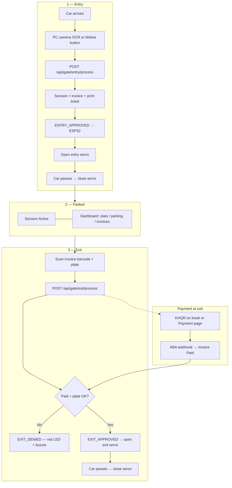
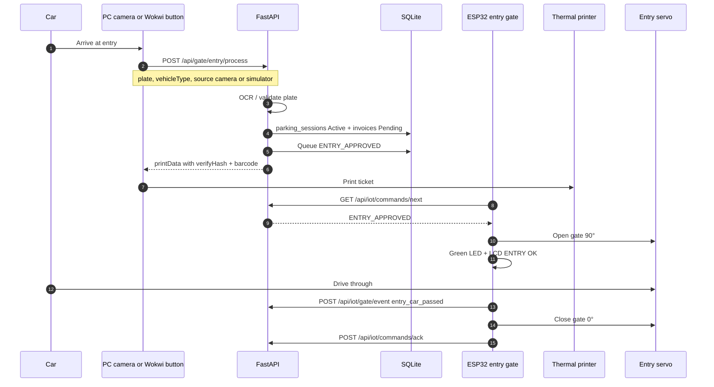
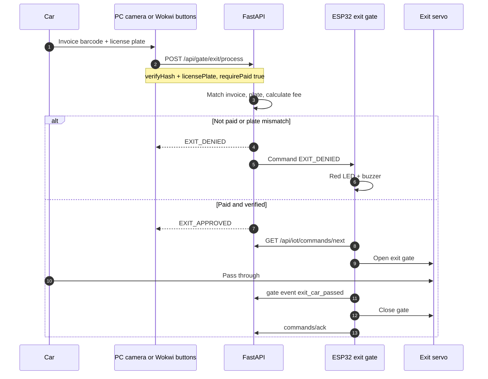

# IOT Parking System

Smart parking management — IoT entry/exit gates, PC camera plate scanning, invoice barcode verification, ABA KHQR payment, staff dashboard, and Wokwi ESP32 simulation.

---

## Overview

The **IOT Parking System** automates a parking lot from entry to exit. A vehicle arrives at the **entry gate**: a computer camera reads the license plate, FastAPI creates a parking session and invoice, and a thermal printer issues a ticket with a **barcode** (`verifyHash`). FastAPI sends **ENTRY_APPROVED** to an ESP32, which opens the entry servo; after the car passes, a sensor (or operator button) closes the gate.

While parked, staff use the **web dashboard** for occupancy, history, and billing. At **exit**, cameras scan the invoice barcode and the license plate; FastAPI verifies the ticket, plate, and **ABA payment** status. If approved, **EXIT_APPROVED** opens the exit gate; if payment fails or the plate does not match, the ESP32 shows an error (red LED + buzzer).

| Layer | Role | Users |
|-------|------|--------|
| **Edge (IoT)** | ESP32 servos, LCD, LEDs, buzzer, printers, barcode scanners, lane PC cameras | Drivers (indirect), lane hardware |
| **Server** | FastAPI, SQLite, gate command queue, payment webhooks | Lane PC, ESP32, dashboard |
| **Web dashboard** | Analytics, parking history, KHQR payment display, invoice reprint | Staff / admin |

**Design rules**

- The dashboard does **not** open gates or print entry tickets — only IoT lanes and printers do.
- Entry tickets are printed at **entry**; the **Payment** page shows KHQR only (no receipt UI).
- **Fee:** under 1 hour → $1.00 minimum; 1 hour or more → billed hours (rounded up) × $2.00/hour.

**Simulator vs real hardware**

| | **Wokwi simulator** | **Real hardware** |
|---|---------------------|-------------------|
| Camera | Six **buttons** simulate plate / invoice scans (Wokwi has no host webcam) | USB webcam on lane PC + OCR |
| Gate API | `POST /api/gate/*/process` with `source: "simulator"` | Same APIs with `source: "camera"` |
| ESP32 project | `wokwi/parking-gate/` (MicroPython) | Same firmware on physical ESP32 |
| Command delivery | Immediate on device + poll `GATE_SIM_01` | ESP polls `ENTRY_GATE_01` / `EXIT_GATE_01` |

---

## Technology Stack

| Category | Technology | Version / Notes | Purpose |
|----------|------------|-----------------|---------|
| **Backend** | Python | 3.11+ | API and lane scripts |
| **API** | FastAPI | ≥ 0.115 | REST + OpenAPI at `/docs` |
| **Server** | Uvicorn | ≥ 0.32 | ASGI server |
| **ORM** | SQLAlchemy | 2.x | Models and queries |
| **Migrations** | Alembic | ≥ 1.14 | Optional schema migrations |
| **Validation** | Pydantic | v2 | camelCase JSON schemas |
| **Database** | SQLite | `backend/data/iot_parking.db` | Local dev database |
| **Rate limit** | slowapi | ≥ 0.1.9 | Endpoint protection |
| **HTTP client** | httpx | ≥ 0.27 | ABA PayWay calls |
| **KHQR mock** | qrcode + Pillow | ≥ 7.4 | Dev payment QR images |
| **Barcode** | python-barcode | ≥ 0.15 | Code128 on entry tickets |
| **Frontend** | Nuxt | 4.x | Staff dashboard |
| **UI** | Vue 3 + Nuxt UI | 4.x | Components and layout |
| **Language** | TypeScript | 5.9+ | Typed frontend |
| **Styling** | Tailwind CSS | 4.x | Utility CSS |
| **Charts** | ECharts | 6.x | Dashboard graphs |
| **Tables** | TanStack Vue Table | 8.x | Sortable data grids |
| **Package manager** | pnpm | 10.x | Frontend deps |
| **IoT MCU** | ESP32 | — | Gate servos, LCD, LEDs |
| **IoT firmware** | MicroPython | Wokwi | `wokwi/parking-gate/main.py` |
| **Simulation** | Wokwi | — | Full gate diagram + buttons |
| **Lane PC** | Python | `devices/lane_workstation.py` | Real camera → API |

---

## Project Structure

```
IOT-Parking/
├── backend/
│   ├── app/
│   │   ├── main.py
│   │   ├── core/                 # config, database, bootstrap
│   │   ├── models/               # sessions, invoices, device_commands, iot_devices
│   │   ├── schemas/
│   │   ├── routers/              # parking, payment, invoices, dashboard, iot, gate
│   │   ├── services/             # parking, gate lane, payment, ABA, IoT entry/exit
│   │   └── utils/                # barcode, dates, IDs
│   ├── devices/
│   │   ├── lane_workstation.py   # PC camera mode → /api/gate/*
│   │   ├── entry_station.py
│   │   ├── exit_station.py
│   │   └── client.py
│   ├── scripts/                  # reset_db, seed, test_integration
│   ├── docs/IOT_DEVICES.md       # Device headers reference
│   └── data/                     # SQLite (gitignored)
│
├── frontend/
│   └── app/
│       ├── pages/                # /, /parking, /payment, /invoices
│       ├── components/           # tables, KHQR card, invoice preview
│       └── composables/
│
├── wokwi/
│   └── parking-gate/             # Recommended: ESP32 + 2 servos + LCD + 6 buttons
│       ├── diagram.json
│       ├── main.py               # MicroPython
│       └── wokwi.toml
│
├── index.html                    # Presentation slides (← → keys)
└── README.md                     # System documentation (this file)
```

### Backend services

| Module | Responsibility |
|--------|----------------|
| `GateLaneService` | PC/simulator entry & exit → gate commands |
| `GateCommandService` | Queue `ENTRY_APPROVED` / `EXIT_*` for ESP32 poll |
| `IotEntryService` | Session + invoice + `printData` |
| `IotExitService` | Barcode + plate verify, fee, gate events |
| `PaymentService` | Active session, webhook, verify |
| `AbaPayService` | KHQR generation (mock or PayWay) |
| `ParkingService` / `ParkingFeeService` | Sessions and pricing |
| `DashboardService` | Home page analytics |

### Dashboard routes

| Route | Purpose |
|-------|---------|
| `/` | KPIs, charts, occupancy |
| `/parking` | Session history + filters |
| `/payment` | Fee + ABA KHQR (no entry receipt) |
| `/invoices` | List, preview, print receipts |

### Database tables

| Table | Purpose |
|-------|---------|
| `parking_sessions` | Visit while vehicle is inside (`Active` → `Completed`) |
| `invoices` | Ticket; `exit_verify_hash` for barcode |
| `device_commands` | Gate commands for ESP32 (`pending` → `delivered` → `acked`) |
| `iot_devices` | `ENTRY_GATE_01`, `EXIT_GATE_01`, `GATE_SIM_01` |
| `device_logs` | IoT audit trail |
| `payment_transactions` | Payment audit |
| `bank_settings` | Bank info on payment page |

---

## Whole Project Flow



---

## Entry Flow



**Wokwi shortcut:** button **Scan entry plate** calls the same API with `source: simulator` and opens the servo immediately (`executeOnDevice: true`).

---

## Exit Flow



**Wokwi button order:** Scan invoice → Scan exit plate → Payment success → (gate opens) → Close exit gate.

---

## Payment Flow

```mermaid
sequenceDiagram
    autonumber
    participant Customer
    participant UI as Payment page or exit kiosk
    participant API as FastAPI
    participant Bank as ABA Mobile
    participant ESP as Exit ESP32

    Note over API: Exit process sets fee; invoice may be Pending

    UI->>API: GET /api/payment/active-session
    API-->>UI: plate, duration, amount

    UI->>API: GET /api/payment/aba-qr
    API-->>UI: KHQR image

    UI->>Customer: Show amount + QR
    Customer->>Bank: Pay in ABA app
    Bank->>API: POST /api/payment/webhook
    Note over Bank,API: x-webhook-secret, invoiceId, success

    API->>API: invoice Paid, session completed

    ESP->>API: POST /api/gate/exit/process
    API-->>ESP: EXIT_APPROVED
    ESP->>ESP: Open exit servo
```

**Development:** `POST /api/payment/verify` simulates a successful payment without a bank.

---

## Conclusions

This system connects **lane hardware**, a **central API**, and a **staff dashboard** into one traceable parking workflow:

1. **Entry** — Camera OCR (or simulator buttons) → session + printed barcode ticket → ESP32 opens and closes the entry gate.
2. **Parking** — Active sessions and revenue visible on the dashboard; invoices stored for audit.
3. **Exit** — Invoice barcode + plate verification + ABA payment before **EXIT_APPROVED**.
4. **Failure handling** — `EXIT_DENIED` triggers red LED and buzzer on the ESP32 simulator (and should on real hardware).
5. **Separation** — FastAPI owns business rules; ESP32 only executes gate commands and reports sensor events.
6. **Education-friendly** — Wokwi reproduces the full flow without physical cameras or gates.

**Scope today:** SQLite, mock KHQR, device tokens in `.env`, no staff login.

**Future work:** Production PostgreSQL, JWT for dashboard, real ESC/POS printer, live PayWay keys, full OpenCV/cloud LPR on lane PC.

---

## Quick Start

```powershell
# API
cd backend
pip install -r requirements.txt
copy .env.example .env
.\scripts\run_dev.ps1

# UI (new terminal)
cd frontend
copy .env.example .env
pnpm install
pnpm dev
```

| URL | Description |
|-----|-------------|
| http://localhost:3000 | Dashboard |
| http://127.0.0.1:8000/docs | Swagger API |

```powershell
cd backend
python -m scripts.test_integration
python scripts/reset_db.py
```

---

## Key API Endpoints

| Method | Path | Caller |
|--------|------|--------|
| `POST` | `/api/gate/entry/process` | Lane PC / Wokwi |
| `POST` | `/api/gate/exit/process` | Lane PC / Wokwi |
| `GET` | `/api/iot/commands/next?deviceCode=` | ESP32 |
| `POST` | `/api/iot/commands/ack` | ESP32 |
| `POST` | `/api/iot/gate/event` | ESP32 (car passed / gate closed) |
| `POST` | `/api/payment/webhook` | ABA / simulator |
| `GET` | `/api/payment/active-session` | Dashboard |
| `GET` | `/api/payment/aba-qr` | Dashboard |
| `POST` | `/api/iot/entry-scan` | Legacy IoT |
| `POST` | `/api/iot/exit-verify` | Legacy IoT |

Device headers: `x-device-code`, `x-device-token`. Webhook: `x-webhook-secret`.

---

## Wokwi Simulator

1. Start API: `uvicorn app.main:app --host 0.0.0.0 --port 8000`
2. Set `API_HOST` in `wokwi/parking-gate/main.py` to your PC LAN IP (`ipconfig`)
3. Open `wokwi/parking-gate` in the Wokwi extension → **Start Simulation**

| Button | Action |
|--------|--------|
| Scan entry plate | Entry API + open entry servo |
| Close entry gate | Close entry servo |
| Scan invoice | Store ticket verifyHash |
| Scan exit plate | Store plate |
| Payment success | Webhook + exit approve + open exit |
| Close exit gate | Close exit servo |

---

## Environment Files

| File | Purpose |
|------|---------|
| `backend/.env.example` | API, SQLite, IoT tokens, ABA Pay |
| `frontend/.env.example` | `NUXT_PUBLIC_API_URL`, site URL |
| `backend/devices/.env.example` | Lane device credentials |

Do not commit `.env` or `backend/data/*.db`.

---

## Push to GitHub

```powershell
git add .
git status
git commit -m "Initial commit: IOT Parking System"
git branch -M main
git remote add origin https://github.com/YOUR_USERNAME/YOUR_REPO.git
git push -u origin main
```
