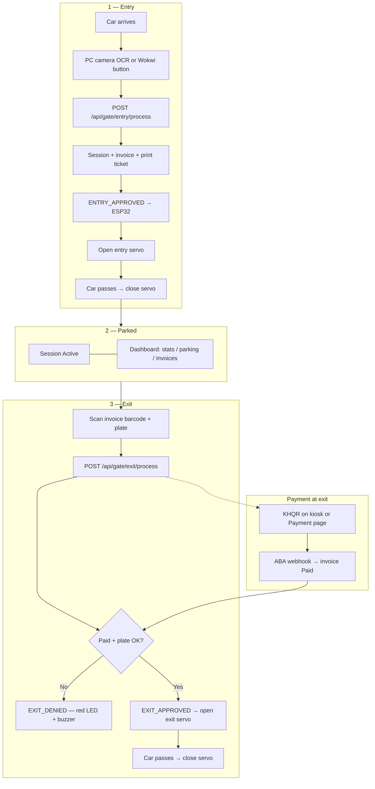
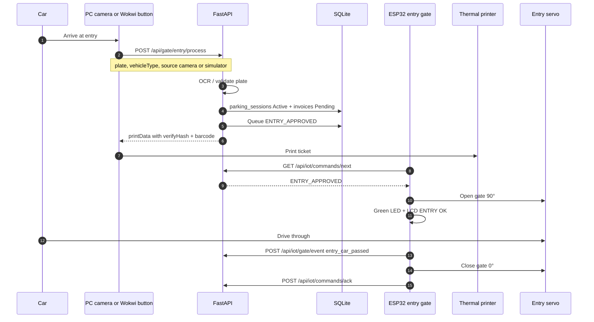
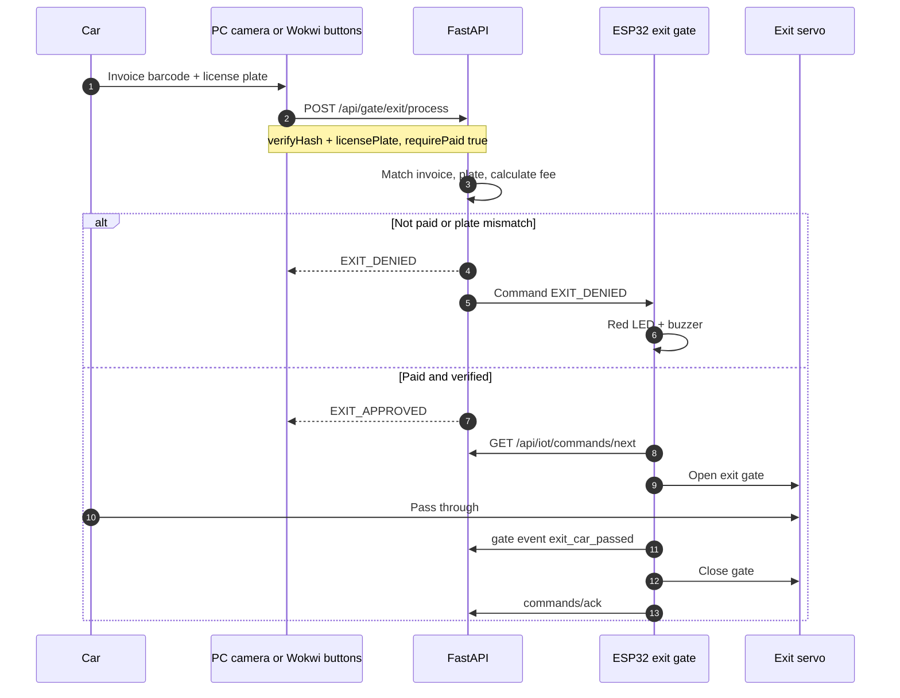
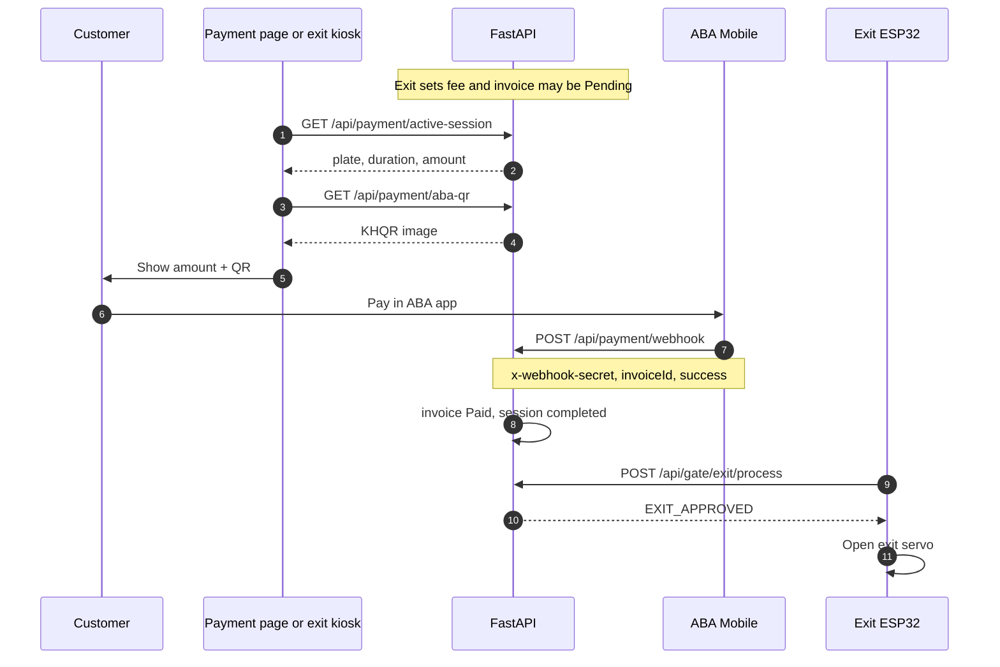

# IOT Parking System

Smart parking management — IoT entry/exit gates, PC camera plate scanning, invoice barcode verification, ABA KHQR payment, staff dashboard, and Wokwi ESP32 simulation.

---

## Overview

The **IOT Parking System** automates a parking lot from entry to exit. A vehicle arrives at the **entry gate**: a computer camera reads the license plate, FastAPI creates a parking session and invoice, and a thermal printer issues a ticket with a **barcode** (`verifyHash`). FastAPI sends **ENTRY_APPROVED** to an ESP32, which opens the entry servo; after the car passes, a sensor (or operator button) closes the gate.

While parked, staff use the **web dashboard** for occupancy, history, and billing. At **exit**, cameras scan the invoice barcode and the license plate; FastAPI verifies the ticket, plate, and **ABA payment** status. If approved, **EXIT_APPROVED** opens the exit gate; if payment fails or the plate does not match, the ESP32 shows an error (red LED + buzzer).

| Layer | Role | Users |
|-------|------|--------|
| **Edge (IoT)** | ESP32 servos, LCD, LEDs, buzzer, printers, barcode scanners, lane PC cameras | Drivers (indirect), lane hardware |
| **Server** | FastAPI, SQLite, gate command queue, payment webhooks | Lane PC, ESP32, dashboard |
| **Web dashboard** | Analytics, parking history, KHQR payment display, invoice reprint | Staff / admin |

**Design rules**

- The dashboard does **not** open gates or print entry tickets — only IoT lanes and printers do.
- Entry tickets are printed at **entry**; the **Payment** page shows KHQR only (no receipt UI).
- **Fee:** under 1 hour → $1.00 minimum; 1 hour or more → billed hours (rounded up) × $2.00/hour.

**Simulator vs real hardware**

| | **Wokwi simulator** | **Real hardware** |
|---|---------------------|-------------------|
| Camera | **Two buttons** (entry / exit) simulate scans — Wokwi has no host webcam | USB webcam on lane PC + OCR |
| Gate API | `POST /api/gate/*/process` with `source: "simulator"` | Same APIs with `source: "camera"` |
| ESP32 project | `wokwi/parking-gate/` (MicroPython) | Same firmware on physical ESP32 |
| Command delivery | Immediate on device + poll `GATE_SIM_01` | ESP polls `ENTRY_GATE_01` / `EXIT_GATE_01` |

---

## How to Run

Open a terminal in the **repository root** (`IOT-Parking/`). Commands below assume **PowerShell** on Windows.

### Prerequisites

| Tool | Notes |
|------|--------|
| Python **3.11+** | Backend + lane scripts |
| Node.js + **pnpm** | Dashboard (`frontend/`) |
| **Wokwi** (optional) | VS Code extension or [wokwi.com](https://wokwi.com) + `wokwigw.exe` in `wokwigw_v2.0.1_Windows_64bit/` |

### One-time setup

```powershell
cd IOT-Parking

python -m venv .venv
.\.venv\Scripts\Activate.ps1

cd backend
pip install -r requirements.txt
if (-not (Test-Path .env)) { Copy-Item .env.example .env }

cd ..\frontend
if (-not (Test-Path .env)) { Copy-Item .env.example .env }
pnpm install
```

### Run commands (pick what you need)

Use **separate terminals** — keep each process running.

| # | What | Command | Open in browser |
|---|------|---------|-----------------|
| **1** | **API** (required) | From repo root: `.\scripts\run_backend.ps1` — or from `backend/`: `.\scripts\run_dev.ps1` | http://127.0.0.1:8000/docs |
| **2** | **Dashboard** (optional) | `cd frontend` → `pnpm dev` | http://localhost:3000 |
| **3** | **Wokwi gateway** (sim only) | `.\wokwigw_v2.0.1_Windows_64bit\wokwigw.exe` | — (listens on port **9011**) |
| **4** | **Wokwi sim** | **Start Simulation** → `cd wokwi\parking-gate` → `.\upload_to_wokwi.ps1` or `.\boot_esp32.ps1 -Upload` | **Wokwi Serial Monitor** (View → Output) |

**Minimal API only** (no UI, no Wokwi):

```powershell
cd IOT-Parking
.\.venv\Scripts\Activate.ps1
cd backend
.\scripts\run_dev.ps1
```

**Health check:**

```powershell
curl http://127.0.0.1:8000/health
```

**Presentation deck only** (no server):

```powershell
start index.html
```

### ESP32 boot — show output on Serial Monitor

**Where to look:** VS Code → **View → Output** → dropdown **Wokwi Serial Monitor** (not the Terminal tab).

**One-time (firmware + upload tool):**

```powershell
cd IOT-Parking
.\.venv\Scripts\Activate.ps1
pip install mpremote==1.23

cd wokwi\parking-gate
.\download_firmware.ps1
```

**Boot sequence (each time you simulate):**

| Step | Action |
|------|--------|
| 1 | VS Code: open `wokwi/parking-gate/diagram.json` → click **Start Simulation** (green play) |
| 2 | Serial Monitor should show MicroPython banner and `>>>` |
| 3 | Upload app + reboot ESP32: |

```powershell
cd wokwi\parking-gate
.\upload_to_wokwi.ps1
```

Or upload + reset in one helper:

```powershell
.\boot_esp32.ps1 -Upload
```

**Reset only** (re-run `boot.py` + `main.py`, keep watching Serial Monitor):

```powershell
.\boot_esp32.ps1
```

**Manual mpremote** (simulation must be running on port **4000**):

```powershell
# Hard reset — boot messages appear in Wokwi Serial Monitor
mpremote connect port:rfc2217://localhost:4000 reset

# REPL in this PowerShell window (exit with Ctrl+])
mpremote connect port:rfc2217://localhost:4000 repl
```

If upload fails: click **Wokwi Serial Monitor** → **Ctrl+C** → **Ctrl+A** → run `.\upload_to_wokwi.ps1` again.

**Healthy boot log (example):**

```text
boot.py: MicroPython starting
Booting...
Import OK: i2c_lcd.I2cLcd
I2C devices: [39]
LCD: IOT Parking | LCD Working
API online
```

### Wokwi buttons (after steps 1 + 3 + 4)

| Button | Action |
|--------|--------|
| Green | Entry → session + receipt + open entry gate |
| Blue | Exit → scan barcode flow + mock pay (if enabled) → open exit gate |

Reset stuck sessions:

```powershell
cd wokwi\parking-gate
.\reset_parking_db.ps1
```

### Test without hardware

```powershell
cd backend
.\.venv\Scripts\Activate.ps1
python -m scripts.test_integration
powershell -File scripts\test_wokwi_flow.ps1
```

Lane PC (webcam) — API must already run on port **8000**:

```powershell
cd backend
python devices/lane_workstation.py entry
python devices/lane_workstation.py entry --plate 2A-1234
python devices/lane_workstation.py exit --hash YOUR_VERIFY_HASH --plate WK-SIM01
```

### Stop

Press **Ctrl+C** in each terminal (API, `pnpm dev`, `wokwigw.exe`, Wokwi simulation).

---

## Technology Stack

| Category | Technology | Version / Notes | Purpose |
|----------|------------|-----------------|---------|
| **Backend** | Python | 3.11+ | API and lane scripts |
| **API** | FastAPI | ≥ 0.115 | REST + OpenAPI at `/docs` |
| **Server** | Uvicorn | ≥ 0.32 | ASGI server |
| **ORM** | SQLAlchemy | 2.x | Models and queries |
| **Migrations** | Alembic | ≥ 1.14 | Optional schema migrations |
| **Validation** | Pydantic | v2 | camelCase JSON schemas |
| **Database** | SQLite | `backend/data/iot_parking.db` | Local dev database |
| **Rate limit** | slowapi | ≥ 0.1.9 | Endpoint protection |
| **HTTP client** | httpx | ≥ 0.27 | ABA PayWay calls |
| **KHQR mock** | qrcode + Pillow | ≥ 7.4 | Dev payment QR images |
| **Barcode** | python-barcode | ≥ 0.15 | Code128 on entry tickets |
| **Frontend** | Nuxt | 4.x | Staff dashboard |
| **UI** | Vue 3 + Nuxt UI | 4.x | Components and layout |
| **Language** | TypeScript | 5.9+ | Typed frontend |
| **Styling** | Tailwind CSS | 4.x | Utility CSS |
| **Charts** | ECharts | 6.x | Dashboard graphs |
| **Tables** | TanStack Vue Table | 8.x | Sortable data grids |
| **Package manager** | pnpm | 10.x | Frontend deps |
| **IoT MCU** | ESP32 | — | Entry + exit servos, LCD |
| **IoT firmware** | MicroPython | Wokwi | `wokwi/parking-gate/main.py` |
| **Simulation** | Wokwi | — | Full gate diagram + buttons |
| **Lane PC** | Python | `devices/lane_workstation.py` | Real camera → API |

---

## Project Structure

```
IOT-Parking/
├── backend/
│   ├── app/
│   │   ├── main.py
│   │   ├── core/                 # config, database, bootstrap
│   │   ├── models/               # sessions, invoices, device_commands, iot_devices
│   │   ├── schemas/
│   │   ├── routers/              # parking, payment, invoices, dashboard, iot, gate
│   │   ├── services/             # parking, gate lane, payment, ABA, IoT entry/exit
│   │   └── utils/                # barcode, dates, IDs
│   ├── devices/
│   │   ├── lane_workstation.py   # PC camera mode → /api/gate/*
│   │   ├── entry_station.py
│   │   ├── exit_station.py
│   │   └── client.py
│   ├── scripts/                  # reset_db, seed, test_integration
│   ├── docs/IOT_DEVICES.md       # Device headers reference
│   └── data/                     # SQLite (gitignored)
│
├── frontend/
│   └── app/
│       ├── pages/                # /, /parking, /payment, /invoices
│       ├── components/           # tables, KHQR card, invoice preview
│       └── composables/
│
├── wokwi/
│   └── parking-gate/             # Only IoT simulator — ESP32 + entry/exit servos + LCD
│       ├── diagram.json
│       ├── main.py               # MicroPython firmware
│       └── wokwi.toml
│
├── wokwigw_v2.0.1_Windows_64bit/ # Wokwi Private IoT Gateway (wokwigw.exe)
│
├── index.html                    # Full-screen presentation (edit only this file)
├── docs/images/                  # Slide photos: 01-welcome.jpg … 13-thankyou.jpg, team-1…4.jpg
└── README.md                     # System documentation (this file)
```

### Backend services

| Module | Responsibility |
|--------|----------------|
| `GateLaneService` | PC/simulator entry & exit → gate commands |
| `GateCommandService` | Queue `ENTRY_APPROVED` / `EXIT_*` for ESP32 poll |
| `IotEntryService` | Session + invoice + `printData` |
| `IotExitService` | Barcode + plate verify, fee, gate events |
| `PaymentService` | Active session, webhook, verify |
| `AbaPayService` | KHQR generation (mock or PayWay) |
| `ParkingService` / `ParkingFeeService` | Sessions and pricing |
| `DashboardService` | Home page analytics |

### Dashboard routes

| Route | Purpose |
|-------|---------|
| `/` | KPIs, charts, occupancy |
| `/parking` | Session history + filters |
| `/payment` | Fee + ABA KHQR (no entry receipt) |
| `/invoices` | List, preview, print receipts |

### Database tables

| Table | Purpose |
|-------|---------|
| `parking_sessions` | Visit while vehicle is inside (`Active` → `Completed`) |
| `invoices` | Ticket; `exit_verify_hash` for barcode |
| `device_commands` | Gate commands for ESP32 (`pending` → `delivered` → `acked`) |
| `iot_devices` | `ENTRY_GATE_01`, `EXIT_GATE_01`, `GATE_SIM_01` |
| `device_logs` | IoT audit trail |
| `payment_transactions` | Payment audit |
| `bank_settings` | Bank info on payment page |

---

## Whole Project Flow



---

## Entry Flow



**Wokwi shortcut:** button **Scan entry plate** calls the same API with `source: simulator` and opens the servo immediately (`executeOnDevice: true`).

---

## Exit Flow



**Wokwi:** press **Open exit** after entry (mock payment runs automatically).

---

## Payment Flow



**Development:** `POST /api/payment/verify` simulates a successful payment without a bank.

---

## Conclusions

This system connects **lane hardware**, a **central API**, and a **staff dashboard** into one traceable parking workflow:

1. **Entry** — Camera OCR (or simulator buttons) → session + printed barcode ticket → ESP32 opens and closes the entry gate.
2. **Parking** — Active sessions and revenue visible on the dashboard; invoices stored for audit.
3. **Exit** — Invoice barcode + plate verification + ABA payment before **EXIT_APPROVED**.
4. **Failure handling** — `EXIT_DENIED` triggers red LED and buzzer on the ESP32 simulator (and should on real hardware).
5. **Separation** — FastAPI owns business rules; ESP32 only executes gate commands and reports sensor events.
6. **Education-friendly** — Wokwi reproduces the full flow without physical cameras or gates.

**Scope today:** SQLite, mock KHQR, device tokens in `.env`, no staff login.

**Future work:** Production PostgreSQL, JWT for dashboard, real ESC/POS printer, live PayWay keys, full OpenCV/cloud LPR on lane PC.

---

## Quick Start (detailed)

Same commands as **[How to Run](#how-to-run)** above. Use **four terminals** for the full Wokwi demo (or three without the dashboard).

### Step 1 — Backend API (terminal 1)

```powershell
cd IOT-Parking
.\.venv\Scripts\Activate.ps1
.\scripts\run_backend.ps1
```

Or manually: `cd backend` → `uvicorn app.main:app --reload --host 0.0.0.0 --port 8000`

Wait until you see `Application startup complete`.  
Check: http://127.0.0.1:8000/health → `"status":"ok"`

### Step 2 — Dashboard UI (terminal 2, optional)

```powershell
cd IOT-Parking\frontend
pnpm dev
```

Open: http://localhost:3000  
API docs: http://127.0.0.1:8000/docs

### Step 3 — Wokwi IoT Gateway (terminal 3)

From the repo root, run the gateway that ships with this project:

```powershell
cd IOT-Parking
.\wokwigw_v2.0.1_Windows_64bit\wokwigw.exe
```

You should see:

```text
Listening on TCP Port 9011
```

Leave this window open. The simulator uses this to reach your PC at `host.wokwi.internal:8000`.

### Step 4 — Wokwi simulation (VS Code + MicroPython)

**Important:** In VS Code, `wokwi.toml` must point to the **MicroPython `.bin` firmware**, not `main.py`.  
If you see `rst:0x3 (SW_RESET)` repeating forever, the wrong firmware was loaded — follow below.

1. Open **`wokwi/parking-gate`** in VS Code (Wokwi extension).
2. Firmware (once): `.\download_firmware.ps1` → creates `ESP32_GENERIC-20251209-v1.27.0.bin`.
3. Install tools: `pip install mpremote==1.23`
4. Click **Start Simulation** on `diagram.json`.
5. Serial should show **MicroPython** banner and `>>>`, not only `ets Jul 29 2019` in a loop.
6. Upload code (simulation must stay running):
   ```powershell
   cd wokwi\parking-gate
   .\upload_to_wokwi.ps1
   ```
7. In the **Wokwi Serial Monitor** (not the empty VS Code Terminal tab), you should see:
   `Booting...` → `I2C devices: [39]` → `LCD: IOT Parking | LCD Working`
8. **`wokwi.toml`** has `gateway = "ws://localhost:9011"` — run `wokwigw.exe` (step 3).
9. LCD then shows **API online** when the backend is up.

**wokwi.com (browser):** different flow — use `firmware = 'main.py'` only on the web editor; VS Code needs the `.bin` file.

### Step 5 — Test entry and exit

| Action | What to do |
|--------|------------|
| **Entry** | Press the **green** button → entry servo opens, LCD shows `ENTRY OPEN`, receipt saved under `backend/data/receipts/` |
| **Exit** | Press the **blue** button (after entry) → mock payment runs → exit servo opens |

### Stop everything

- In each terminal: **Ctrl+C**
- Close the Wokwi gateway window

### URLs

| URL | Description |
|-----|-------------|
| http://localhost:3000 | Dashboard |
| http://127.0.0.1:8000/docs | Swagger API |

### Optional — reset database

```powershell
cd IOT-Parking\backend
python scripts\reset_db.py
python scripts\reset_db.py --demo
```

---

## Key API Endpoints

| Method | Path | Caller |
|--------|------|--------|
| `POST` | `/api/gate/entry/process` | Lane PC / Wokwi |
| `POST` | `/api/gate/exit/process` | Lane PC / Wokwi |
| `GET` | `/api/iot/commands/next?deviceCode=` | ESP32 |
| `POST` | `/api/iot/commands/ack` | ESP32 |
| `POST` | `/api/iot/gate/event` | ESP32 (car passed / gate closed) |
| `POST` | `/api/payment/webhook` | ABA / simulator |
| `GET` | `/api/payment/active-session` | Dashboard |
| `GET` | `/api/payment/aba-qr` | Dashboard |
| `POST` | `/api/iot/entry-scan` | Legacy IoT |
| `POST` | `/api/iot/exit-verify` | Legacy IoT |

Device headers: `x-device-code`, `x-device-token`. Webhook: `x-webhook-secret`.

---

## One-button lanes (camera + Wokwi)

| Button | API | What happens |
|--------|-----|----------------|
| **Entry** | `POST /api/gate/entry/trigger` | PC **OpenCV** reads plate → session + invoice → **print receipt** (`backend/data/receipts/`) → open gate → **auto-close 60s** |
| **Exit** | `POST /api/gate/exit/trigger` | PC camera reads **invoice barcode** + **plate** → verify → **mock payment** (test) or wait for ABA → open exit gate |

### Test on PC (no Wokwi)

```powershell
cd backend
pip install -r requirements.txt
# Optional: install Tesseract OCR for better plate reads
uvicorn app.main:app --host 0.0.0.0 --port 8000

# Entry — uses webcam (or --plate WK-SIM01 to skip camera)
python devices/lane_workstation.py entry
python devices/lane_workstation.py entry --plate 2A-1234

# Exit — mock payment enabled via GATE_AUTO_MOCK_PAYMENT=true
python devices/lane_workstation.py exit --hash YOUR_VERIFY_HASH --plate WK-SIM01

# Manual mock pay
python devices/lane_workstation.py mock-pay IN-000001
```

Or Swagger: http://127.0.0.1:8000/docs → **gate** → `entry/trigger`, `exit/trigger`, `exit/mock-payment`

### Wokwi troubleshooting

| Symptom | Fix |
|---------|-----|
| `rst:0x3 (SW_RESET)` loop, `ets Jul 29 2019` only | Wrong firmware — use `ESP32_GENERIC-*.bin` in `wokwi.toml`, run `upload_to_wokwi.ps1` |
| Serial empty / no `Booting...` | Upload `.py` files with `upload_to_wokwi.ps1`; watch **Wokwi Serial Monitor** |
| **Blank LCD** but serial shows `LCD test OK` | Restart simulation; check LCD on GPIO 21/22 |
| **API offline** | Start API, run `wokwigw`, port 9011 |
| **ENTRY FAIL / active session** | Run `wokwi\parking-gate\reset_parking_db.ps1` or press entry again (re-opens same session) |
| **EXIT / barcode error** | Press **entry** first; exit needs `verifyHash` from entry |
| **mpremote raw repl failed** | Click Wokwi Serial Monitor → Ctrl+C → Ctrl+A → `upload_to_wokwi.ps1` again |

If port **8000** is blocked, allow it in Windows Firewall or stop the other program using that port.

Only open **`wokwi/parking-gate/`** in Wokwi (no other simulator folders).

---

## Environment Files

| File | Purpose |
|------|---------|
| `backend/.env.example` | API, SQLite, IoT tokens, ABA Pay |
| `frontend/.env.example` | `NUXT_PUBLIC_API_URL`, site URL |
| `backend/devices/.env.example` | Lane device credentials |

Do not commit `.env` or `backend/data/*.db`.

---

## Push to GitHub

```powershell
git add .
git status
git commit -m "Initial commit: IOT Parking System"
git branch -M main
git remote add origin https://github.com/YOUR_USERNAME/YOUR_REPO.git
git push -u origin main
```
