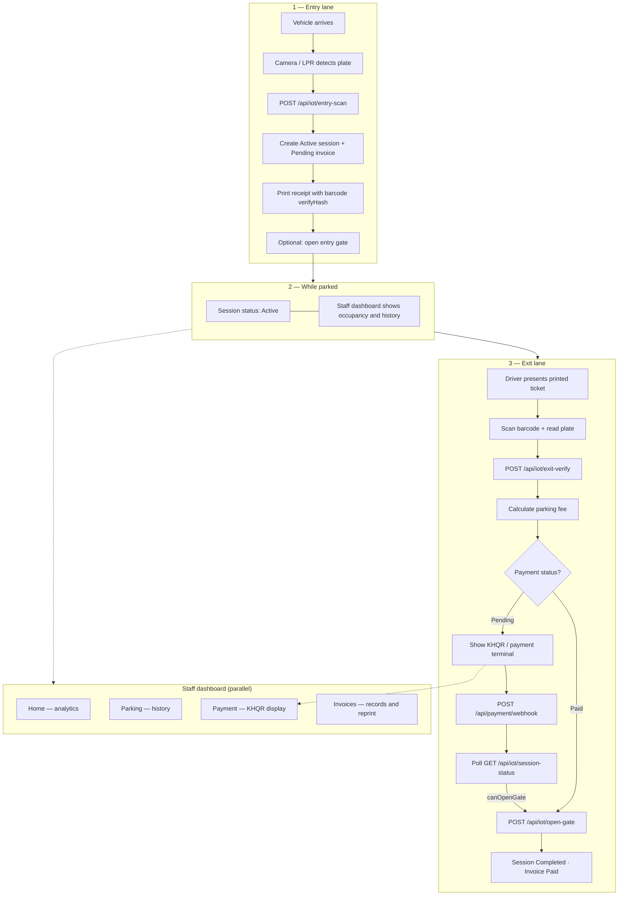
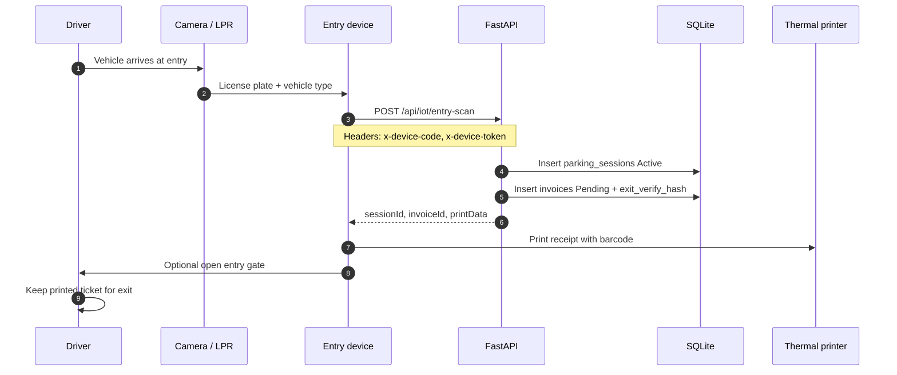
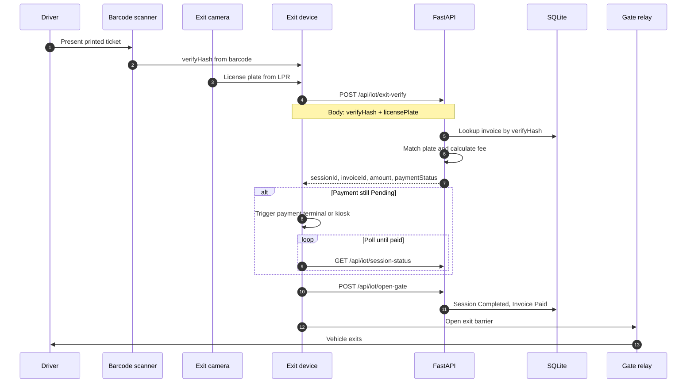
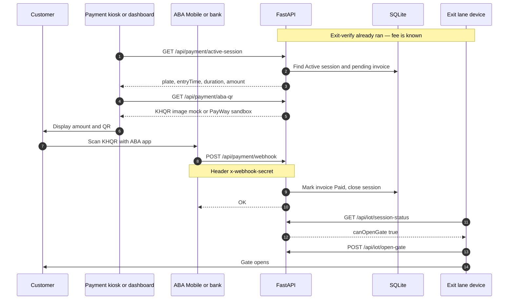

# IOT Parking System

Smart parking management platform — IoT entry/exit lanes, barcode ticket verification, KHQR payment, and a staff web dashboard.

---

## Overview

The **IOT Parking System** automates parking operations from vehicle entry to exit payment. When a car enters, an IoT device records the license plate, creates a parking session and invoice, and prints a thermal receipt with a **barcode** for exit verification. At exit, the lane scans the barcode and confirms the plate, the backend calculates the fee, the customer pays via **ABA Pay / KHQR**, and the gate opens after payment is confirmed.

The system is split into three layers:

| Layer | Role | Users |
|-------|------|--------|
| **Edge (IoT)** | Cameras, printers, barcode scanners, gate relays, ESP32 simulators | Drivers (indirect), lane hardware |
| **Server** | FastAPI REST API, business logic, SQLite database | All clients over HTTP |
| **Web dashboard** | Real-time stats, parking history, payment display, invoices | Parking staff / admin |

**Design rule:** The web dashboard does **not** control gates or printers. Only registered IoT devices call `/api/iot/*`. Staff use reporting APIs and the payment display page for KHQR.

**Fee rules:** Under 1 hour → minimum $1.00. One hour or more → billed hours (rounded up) × $2.00/hour.

---

## Technology Stack

| Category | Technology | Version / Notes | Purpose |
|----------|------------|-----------------|---------|
| **Backend language** | Python | 3.11+ | API server and IoT lane scripts |
| **API framework** | FastAPI | ≥ 0.115 | REST API, OpenAPI docs at `/docs` |
| **ASGI server** | Uvicorn | ≥ 0.32 | Development and production server |
| **ORM** | SQLAlchemy | 2.x | Database models and queries |
| **Migrations** | Alembic | ≥ 1.14 | Schema migrations (optional) |
| **Validation** | Pydantic | v2 | Request/response schemas (camelCase JSON) |
| **Database** | SQLite | `backend/data/iot_parking.db` | Local development; single-file DB |
| **Rate limiting** | slowapi | ≥ 0.1.9 | API abuse protection |
| **HTTP client** | httpx | ≥ 0.27 | ABA PayWay sandbox calls |
| **QR generation** | qrcode + Pillow | ≥ 7.4 | Mock ABA KHQR images |
| **Barcode** | python-barcode | ≥ 0.15 | Code128 exit verification on printed ticket |
| **Frontend framework** | Nuxt | 4.x | Staff dashboard SPA |
| **UI library** | Vue | 3.5+ | Reactive UI |
| **Language** | TypeScript | 5.9+ | Type-safe frontend code |
| **Component library** | Nuxt UI | 4.x | Tables, forms, layout, badges |
| **Styling** | Tailwind CSS | 4.x | Utility-first CSS |
| **Charts** | ECharts + vue-echarts | 6.x / 8.x | Dashboard analytics |
| **Tables** | TanStack Vue Table | 8.x | Sortable, filterable data grids |
| **State / data** | Pinia, Vue Query | — | Client state and API caching |
| **i18n** | @nuxtjs/i18n | 10.x | English UI |
| **Package manager** | pnpm | 10.x | Frontend dependencies |
| **IoT simulation** | Wokwi + ESP32 (C++) | — | Entry/exit gate HTTP demo |
| **IoT scripts** | Python | `backend/devices/` | Lane clients without physical hardware |

---

## Project Structure

```
IOT-Parking/
├── backend/                      # FastAPI API server
│   ├── app/
│   │   ├── main.py               # App entry, CORS, routers, health
│   │   ├── core/                 # Config, database, bootstrap, security
│   │   ├── models/               # SQLAlchemy tables (sessions, invoices, devices…)
│   │   ├── schemas/              # Pydantic request/response DTOs
│   │   ├── routers/              # HTTP routes (parking, payment, iot…)
│   │   ├── services/             # Business logic layer
│   │   └── utils/                # Dates, IDs, barcode, QR helpers
│   ├── devices/                  # Entry/exit lane Python clients
│   │   ├── entry_station.py      # Entry: scan → print ticket → gate
│   │   ├── exit_station.py       # Exit: barcode → pay → open gate
│   │   └── client.py             # Shared HTTP client for IoT API
│   ├── scripts/
│   │   ├── reset_db.py           # Wipe test data
│   │   ├── seed.py               # Optional demo sessions
│   │   └── test_integration.py   # End-to-end API test
│   ├── docs/IOT_DEVICES.md       # IoT integration guide
│   ├── data/                     # SQLite DB (gitignored, created on first run)
│   ├── .env.example              # Environment template
│   └── requirements.txt
│
├── frontend/                     # Nuxt 4 staff dashboard
│   ├── app/
│   │   ├── pages/                # index, parking, payment, invoices
│   │   ├── components/           # Tables, KHQR card, invoice preview
│   │   ├── composables/          # API hooks and table logic
│   │   ├── layouts/              # Dashboard shell + sidebar
│   │   └── assets/               # CSS, images (logo)
│   ├── public/                   # favicon, static files
│   ├── nuxt.config.ts
│   └── .env.example
│
├── wokwi/                        # ESP32 simulators (Wokwi)
│   ├── entry-gate/               # Simulated entry button → entry-scan
│   └── exit-gate/                # Simulated exit scan → exit-verify
│
├── docs/
│   └── SYSTEM_DOCUMENTATION.md   # Extended technical documentation
│
├── index.html                    # Presentation slides (browser)
├── README.md                     # This file
└── .gitignore
```

### Key modules (backend services)

| Module | Responsibility |
|--------|----------------|
| `ParkingService` | Create, list, and close parking sessions |
| `ParkingFeeService` | Time-based fee calculation |
| `InvoiceService` | Pending/paid invoices linked to sessions |
| `PrinterService` | Receipt `printData` for entry thermal printer |
| `IotEntryService` | Entry scan → session + invoice + barcode ticket |
| `IotExitService` | Exit verify (barcode + plate), gate control |
| `PaymentService` | Active session, payment verify, bank webhook |
| `AbaPayService` | ABA PayWay / mock KHQR QR generation |
| `DashboardService` | Stats, occupancy, charts for home page |

### Dashboard pages

| Route | Purpose |
|-------|---------|
| `/` | KPIs, occupancy trend, vehicle types, peak hours |
| `/parking` | Parking history with filters |
| `/payment` | Active vehicle fee + ABA KHQR display (no receipt UI) |
| `/invoices` | Invoice list, preview, and thermal print |

---

## Whole Project Flow

End-to-end lifecycle from entry to exit:



---

## Entry Flow

When a vehicle enters the parking lot:



**Printed ticket includes:** invoice number, plate, vehicle type, entry date/time, **Code128 barcode** (`verifyHash`).

---

## Exit Flow

When a vehicle leaves the parking lot:



---

## Payment Flow

Payment happens at exit (IoT terminal or staff kiosk). The **Payment** page shows the fee and ABA KHQR for the active session — invoices are printed at entry only.



**Alternative (development):** `POST /api/payment/verify` with plate and amount simulates a successful payment.

---

## Conclusions

This project demonstrates a complete **IoT + web** parking solution suitable for university presentation and local development:

1. **Separation of concerns** — IoT devices handle lanes; the dashboard is for monitoring, payment display, and billing records only.
2. **Traceability** — Every visit links a parking session, invoice, and payment transaction.
3. **Secure exit verification** — HMAC-based `verifyHash` on a printed barcode, validated with the license plate at exit.
4. **Digital payment ready** — ABA PayWay / KHQR with webhook confirmation before the gate opens.
5. **Demo without full hardware** — Wokwi ESP32 simulators and Python lane scripts use the same API as real devices.

**Current scope (development):** SQLite, mock ABA QR by default, no staff login, device tokens in `.env` for local testing.

**Future work:** PostgreSQL, JWT auth, real ESC/POS printer SDK, live PayWay credentials, multi-lot support.

For API reference, database design, and demo script see **[docs/SYSTEM_DOCUMENTATION.md](docs/SYSTEM_DOCUMENTATION.md)**.

---

## Quick Start

```powershell
# API
cd backend
pip install -r requirements.txt
copy .env.example .env
.\scripts\run_dev.ps1

# UI (new terminal)
cd frontend
copy .env.example .env
pnpm install
pnpm dev
```

| URL | Description |
|-----|-------------|
| http://localhost:3000 | Staff dashboard |
| http://127.0.0.1:8000/docs | API documentation (Swagger) |

```powershell
cd backend
python -m scripts.test_integration
python scripts/reset_db.py
```

---

## Environment Files

| File | Purpose |
|------|---------|
| `backend/.env.example` | Copy to `backend/.env` |
| `frontend/.env.example` | Copy to `frontend/.env` |
| `backend/devices/.env.example` | Optional lane PC credentials |

Never commit `.env` or `backend/data/*.db`.

---

## IoT and Simulation

| Component | Path |
|-----------|------|
| Wokwi entry gate | `wokwi/entry-gate/` |
| Wokwi exit gate | `wokwi/exit-gate/` |
| Entry lane script | `backend/devices/entry_station.py` |
| Exit lane script | `backend/devices/exit_station.py` |

Details: **[backend/docs/IOT_DEVICES.md](backend/docs/IOT_DEVICES.md)**

---

## Push to GitHub

```powershell
cd D:\IOT-Parking
git add .
git status
git commit -m "Initial commit: IOT Parking System"
git branch -M main
git remote add origin https://github.com/YOUR_USERNAME/YOUR_REPO.git
git push -u origin main
```
