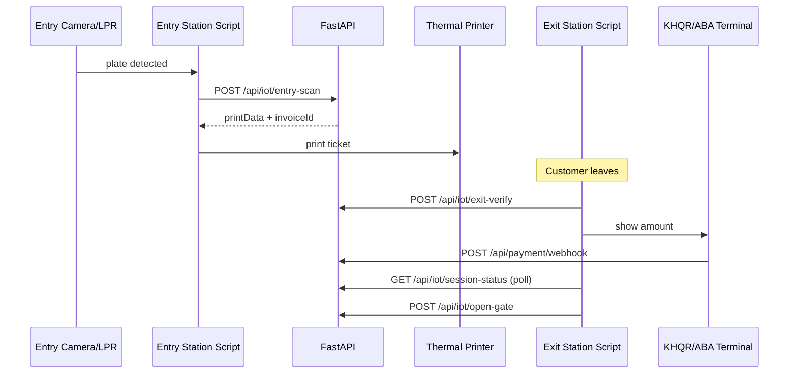

# Real IoT device integration

The **dashboard** (Nuxt) is for staff only: parking history, **Invoices** (view/reprint receipts), payment display (KHQR only — no receipt UI), analytics.

**Parking receipt / invoice:** printed at **entry** (`printData` on `entry-scan`). The customer keeps this ticket. At **exit**, scan the ticket barcode (`verifyHash`) + plate on `exit-verify`, then pay (terminal webhook or payment kiosk). The **Payment** page shows amount + KHQR only — it does not show or print invoices.

**Entry, exit, gates, printers, and lane payment** are handled by physical devices calling the FastAPI backend directly — not through the web UI.

## Architecture



## Device registry

Each device is a row in `iot_devices` (seeded in `scripts/seed.py`):

| device_code | device_type | token (example) |
|-------------|-------------|-----------------|
| ENTRY_GATE_01 | ENTRY_GATE | secret-entry-token |
| EXIT_GATE_01 | EXIT_GATE | secret-exit-token |
| CAMERA_ENTRY_01 | CAMERA | secret-camera-token |
| PRINTER_01 | PRINTER | secret-printer-token |

Every IoT HTTP call must include:

```http
x-device-code: EXIT_GATE_01
x-device-token: secret-exit-token
```

## Edge software (included)

Run on a Raspberry Pi or lane PC next to the hardware:

| Script | Role |
|--------|------|
| `devices/lane_workstation.py` | PC one-button entry/exit (OpenCV camera) |
| `devices/entry_station.py` | Optional CLI entry lane (no Wokwi) |
| `devices/exit_station.py` | Optional CLI exit lane (no Wokwi) |
| `wokwi/parking-gate/` | **Wokwi simulator** — MicroPython, entry + exit buttons |
| `devices/client.py` | Shared HTTP client |

```bash
cd backend
# Entry lane
set DEVICE_CODE=ENTRY_GATE_01
set DEVICE_TOKEN=secret-entry-token
python devices/entry_station.py --plate 2A-1234 --type Car

# Exit lane
set DEVICE_CODE=EXIT_GATE_01
set DEVICE_TOKEN=secret-exit-token
python devices/exit_station.py --hash ABCDEFGHJKLM --plate 2A-1234
```

**Wokwi:** open only `wokwi/parking-gate/` (not other folders). Replace `read_plate_from_camera()`, `print_ticket()`, and GPIO stubs with your vendor SDKs on real hardware.

## API endpoints for devices

| Method | Path | Used by |
|--------|------|---------|
| POST | `/api/iot/heartbeat` | All devices (health) |
| POST | `/api/iot/entry-scan` | Entry camera / gate |
| POST | `/api/iot/exit-verify` | Exit scanner + camera |
| GET | `/api/iot/session-status?sessionId=` | Exit station (poll until paid) |
| POST | `/api/iot/open-gate` | Exit gate relay |
| POST | `/api/payment/webhook` | Bank / KHQR terminal |

### Payment webhook (real money)

Configure your payment provider to call:

```http
POST /api/payment/webhook
x-webhook-secret: <PAYMENT_WEBHOOK_SECRET from .env>
Content-Type: application/json

{
  "invoiceId": "IN-000001",
  "amount": 5.0,
  "paymentMethod": "KHQR",
  "transactionRef": "BANK-REF-123",
  "success": true
}
```

The exit station polls `session-status` until `canOpenGate` is true, then calls `open-gate`.

## Hardware checklist

- [ ] LPR camera → call `entry-scan` with detected plate
- [ ] Thermal printer → print `printData` from entry response
- [ ] Entry ticket barcode encodes `verifyHash` (generated on entry from plate + session)
- [ ] Exit barcode scanner → `exit-verify` with `verifyHash` + camera plate
- [ ] Payment terminal → webhook on success
- [ ] Gate relay → `open-gate` after paid

## Security notes

- Default tokens (`secret-entry-token`, `secret-exit-token`) are fine for local dev and Wokwi only.
- The dashboard never calls `/api/iot/*` — keep device tokens out of the frontend.
