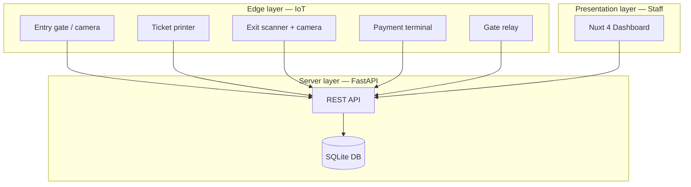
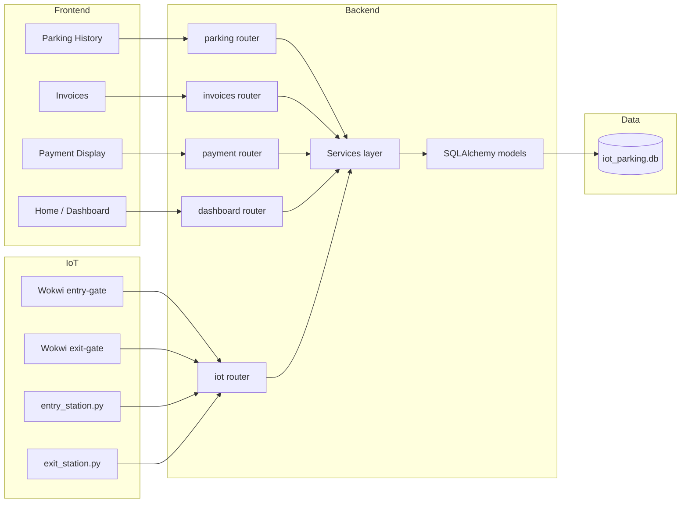
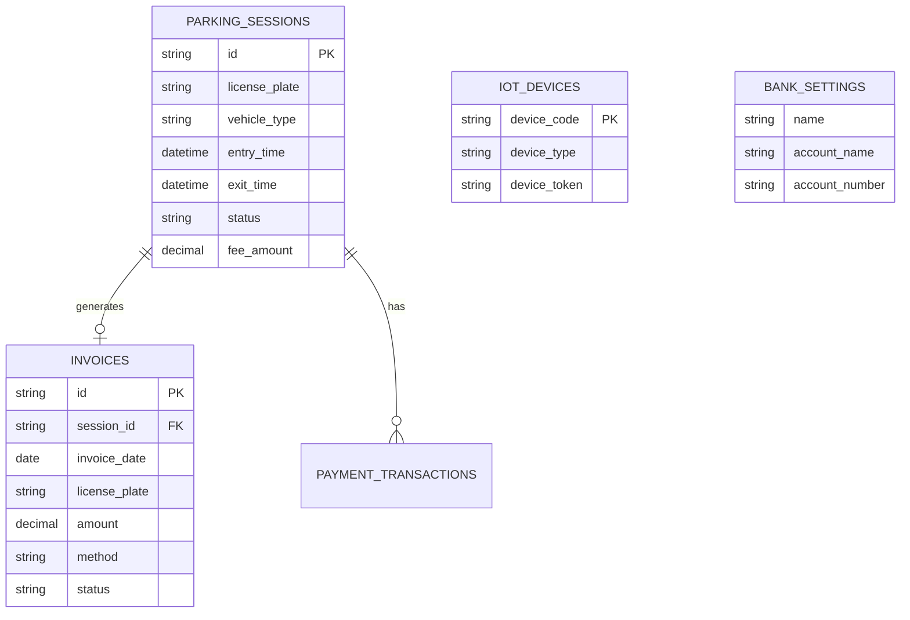
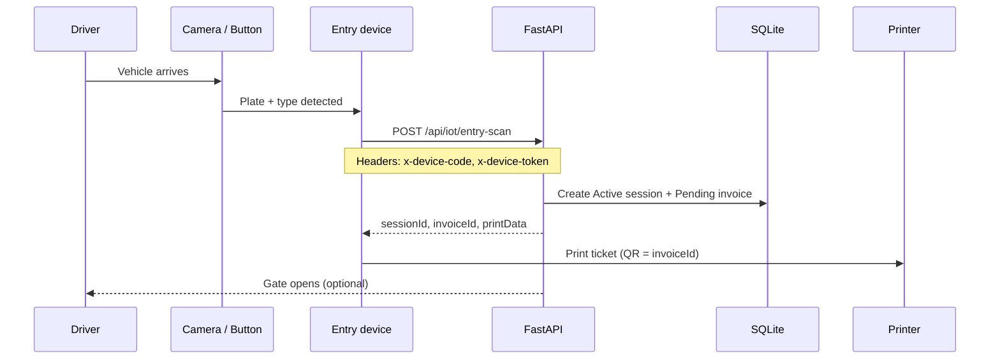
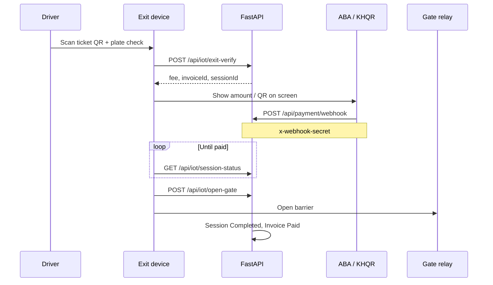

# IoT Smart Parking System — Complete Documentation

> **Use this document** for report appendix and demo rehearsal.  
> **Slides:** open **[../index.html](../index.html)** in Chrome/Edge (**13 slides**, arrow keys, big text for projector).  
> Edit `docs/_parking_slides.html` then: `python docs/build_presentation.py`

---

## 1. Suggested slide outline

| # | Slide title | Source section |
|---|-------------|----------------|
| 1 | Title — IoT Smart Parking System | §2 |
| 2 | Problem statement | §3 |
| 3 | Objectives | §4 |
| 4 | System overview (3 layers) | §5 |
| 5 | Architecture diagram | §6 |
| 6 | Technology stack | §7 |
| 7 | Project structure | §8 |
| 8 | Database design | §9 |
| 9 | Parking fee rules | §10 |
| 10 | Entry flow (IoT) | §11 |
| 11 | Exit & payment flow | §12 |
| 12 | Web dashboard (staff UI) | §13 |
| 13 | REST API summary | §14 |
| 14 | IoT devices & Wokwi simulator | §15 |
| 15 | ABA Pay / KHQR integration | §16 |
| 16 | Security & separation of roles | §17 |
| 17 | Demo steps (live) | §18 |
| 18 | Testing & results | §19 |
| 19 | Limitations (current scope) | §20 |
| 20 | Future work & conclusion | §21–22 |

---

## 2. Project title & summary

**Project name:** IoT Smart Parking System  
**Purpose:** Automate vehicle entry and exit at a parking lot using IoT edge devices, a central API, and a staff web dashboard — with digital payment (ABA Pay / KHQR) at exit.

**What it does:**

- Records **license plate** and **vehicle type** when a car enters.
- Prints a **ticket** with invoice QR at the entry lane.
- At exit, verifies the ticket, calculates **parking fee**, accepts **payment**, then **opens the gate**.
- Staff view **live occupancy**, **revenue**, **parking history**, and **invoices** on a web dashboard.

**Development scope:** Local university project — SQLite database, mock or sandbox payment, Wokwi ESP32 simulator for hardware demo (no physical gate required for presentation).

---

## 3. Problem statement

Traditional parking lots often rely on:

- Manual paper tickets and cash at exit → slow queues, errors, no digital records.
- No real-time view of how many spots are used or daily revenue.
- Disconnected hardware (cameras, gates, printers) without one backend.

**This project solves:** connecting **IoT entry/exit hardware**, a **central API + database**, and a **management dashboard** so parking is traceable, fee calculation is automatic, and payment can be digital (KHQR / ABA).

---

## 4. Objectives

| # | Objective | How the system meets it |
|---|-----------|-------------------------|
| 1 | Automate vehicle entry logging | IoT `entry-scan` API + LPR / simulator |
| 2 | Issue traceable tickets | Invoice ID on printed ticket (`IN-000001`) |
| 3 | Calculate parking fee automatically | Time-based rules in backend |
| 4 | Support digital payment at exit | ABA Pay QR + payment webhook |
| 5 | Control exit gate after payment | `session-status` poll → `open-gate` |
| 6 | Provide staff analytics | Nuxt dashboard (stats, charts, tables) |
| 7 | Demonstrate IoT without full hardware | Wokwi ESP32 + Python lane scripts |

---

## 5. System overview (three layers)



| Layer | Components | Users |
|-------|------------|--------|
| **Edge (IoT)** | ESP32 (Wokwi), entry/exit Python scripts, camera, printer, QR scanner | Drivers (indirect), devices |
| **Server** | FastAPI, SQLAlchemy, SQLite | All clients via HTTP |
| **Web** | Nuxt 4 + Nuxt UI | Parking staff / admin |

**Important design rule:** The dashboard **never** calls IoT endpoints. Only physical devices use `/api/iot/*`. Staff use read-only/list APIs and the payment display page.

---

## 6. Architecture

### 6.1 High-level component diagram



### 6.2 Repository layout

```
IOT-Parking/
├── backend/                 # FastAPI application
│   ├── app/
│   │   ├── main.py          # App entry, CORS, health
│   │   ├── core/            # config, database, bootstrap, security
│   │   ├── models/          # SQLAlchemy tables
│   │   ├── schemas/         # Pydantic request/response (camelCase JSON)
│   │   ├── routers/         # HTTP routes
│   │   └── services/        # Business logic
│   ├── devices/             # Entry/exit lane Python clients
│   ├── scripts/             # seed, test_integration, run_dev.ps1
│   └── data/iot_parking.db  # SQLite file (created on first run)
├── frontend/                # Nuxt 4 staff dashboard
│   └── app/pages/           # index, parking, payment, invoices
├── wokwi/
│   ├── entry-gate/          # ESP32 simulator — entry button
│   └── exit-gate/           # ESP32 simulator — exit + gate LED
└── docs/
    └── SYSTEM_DOCUMENTATION.md   # ← this file
```

---

## 7. Technology stack

| Part | Technology | Role |
|------|------------|------|
| **API** | Python 3.11+, FastAPI | REST server, OpenAPI docs at `/docs` |
| **ORM** | SQLAlchemy 2.x | Models, queries |
| **Database** | SQLite (`data/iot_parking.db`) | Local dev; easy demo on one laptop |
| **Validation** | Pydantic v2 | Request/response schemas |
| **Rate limit** | slowapi | Abuse protection on endpoints |
| **HTTP client** | httpx | ABA PayWay API calls |
| **QR generation** | qrcode (Pillow) | Mock ABA QR images in dev |
| **Frontend** | Nuxt 4, Vue 3, TypeScript | SPA dashboard |
| **UI** | Nuxt UI, Tailwind | Tables, charts, layout |
| **i18n** | @nuxtjs/i18n | English UI |
| **IoT sim** | Wokwi + ESP32 (C++) | Entry/exit HTTP from simulated MCU |
| **IoT scripts** | Python `devices/*.py` | Same API without Wokwi |

---

## 8. Backend modules (for technical slides)

| Module | Responsibility |
|--------|----------------|
| `ParkingService` | Create/list/close parking sessions |
| `ParkingFeeService` | Fee: &lt;1h → minimum $1; else ceil(hours) × $2/h |
| `InvoiceService` | Invoices linked to sessions |
| `PaymentService` | Active session, verify, webhook |
| `AbaPayService` | Generate PayWay QR or mock QR |
| `IotEntryService` | Entry scan, ticket print data |
| `IotExitService` | Exit verify, session status, open gate |
| `DashboardService` | Stats, occupancy trend, peak hours, charts |
| `IotDeviceService` | Device registry, heartbeat |

**Authentication:**

- **IoT devices:** headers `x-device-code` + `x-device-token`
- **Payment webhook:** header `x-webhook-secret`
- **Dashboard:** no login in current dev build (add JWT later for production)

---

## 9. Database design

### 9.1 Entity relationship (conceptual)



### 9.2 Main tables

| Table | Purpose | Example ID |
|-------|---------|------------|
| `parking_sessions` | One visit per plate while parked | `PK-1001` |
| `invoices` | Bill for a session (ticket QR = invoice id) | `IN-000001` |
| `payment_transactions` | Audit trail for verify/webhook | UUID |
| `iot_devices` | Registered gates, cameras, printers | `ENTRY_GATE_01` |
| `bank_settings` | Bank name / account for UI | singleton row |
| `device_logs` | Optional IoT audit | — |

### 9.3 Session status lifecycle

| Status | Meaning |
|--------|---------|
| `Active` | Vehicle inside; `exit_time` is null |
| `Completed` | Exited; fee calculated; gate may have opened |

Invoice status: `Pending` → `Paid` after webhook or verify.

---

## 10. Parking fee rules (business logic)

Configured in `backend/.env`:

- `RATE_PER_HOUR=2.00` (USD)
- `MINIMUM_FEE=1.00` (USD)

**Rules:**

1. If parked **less than 60 minutes** → charge **minimum fee** ($1.00).
2. If parked **60 minutes or more** → charge **ceil(hours) × rate** (e.g. 61 min → 2 hours × $2 = $4.00).

**Example for slides:**

| Duration | Fee |
|----------|-----|
| 30 min | $1.00 |
| 1 h 00 m | $2.00 |
| 2 h 15 m | $6.00 (3 billed hours × $2) |

---

## 11. Entry flow (IoT)



**Request body (example):**

```json
{
  "licensePlate": "2A-1234",
  "vehicleType": "Car",
  "vehicleDescription": "Black SUV"
}
```

**Response includes `printData`:** `invoiceNo`, `plateNumber`, `entryTime`, `qrCode` (invoice id for exit scanner).

---

## 12. Exit & payment flow



**Payment page (staff / kiosk display):**  
`GET /api/payment/active-session` shows the current vehicle;  
`GET /api/payment/aba-qr` returns QR image for customer to scan with ABA Mobile.

---

## 13. Web dashboard (staff UI)

| Page | Route | Data source | Purpose |
|------|-------|-------------|---------|
| **Home** | `/` | `/api/dashboard/*` | KPI cards, occupancy trend, vehicle types, peak hours, interactive chart |
| **Parkings** | `/parking` | `GET /api/parking` | Sortable/searchable parking history |
| **Payment** | `/payment` | `GET /api/payment/active-session`, `aba-qr` | Show fee + ABA QR for paying customer |
| **Invoices** | `/invoices` | `GET /api/invoices` | Paid/Pending invoices, filters |

**Removed from scope (by design):** Entry monitor, exit monitor, settings pages — real IoT handles lanes; dashboard is reporting only.

**Frontend ↔ API:**  
Base URL: `NUXT_PUBLIC_API_URL` (default `http://localhost:8000`).  
All JSON fields use **camelCase** to match TypeScript types.

---

## 14. REST API summary

Base URL: `http://localhost:8000`  
Interactive docs: `http://localhost:8000/docs`

### Health

| Method | Path | Description |
|--------|------|-------------|
| GET | `/health` | API + database status |

### Dashboard (staff)

| Method | Path |
|--------|------|
| GET | `/api/dashboard/stats` |
| GET | `/api/dashboard/occupancy-trend` |
| GET | `/api/dashboard/vehicle-types` |
| GET | `/api/dashboard/peak-hours` |
| GET | `/api/dashboard/interactive-chart` |

### Parking & invoices (staff)

| Method | Path |
|--------|------|
| GET | `/api/parking` |
| GET | `/api/invoices` |

### Payment

| Method | Path |
|--------|------|
| GET | `/api/payment/active-session?plate=` |
| GET | `/api/payment/aba-qr?plateNumber=&amount=&invoiceId=` |
| GET | `/api/payment/bank-info` |
| POST | `/api/payment/verify` |
| POST | `/api/payment/webhook` |

### IoT (devices only)

| Method | Path |
|--------|------|
| POST | `/api/iot/heartbeat` |
| POST | `/api/iot/entry-scan` |
| POST | `/api/iot/exit-verify` |
| GET | `/api/iot/session-status?sessionId=` |
| POST | `/api/iot/open-gate` |

**List response shape:**

```json
{
  "data": [ ... ],
  "total": 8
}
```

---

## 15. IoT devices & Wokwi simulator

### 15.1 Registered devices (seeded on first run)

| device_code | Type | Default token (dev) |
|-------------|------|---------------------|
| `ENTRY_GATE_01` | ENTRY_GATE | `secret-entry-token` |
| `EXIT_GATE_01` | EXIT_GATE | `secret-exit-token` |
| `CAMERA_ENTRY_01` | CAMERA | same as entry |
| `PRINTER_01` | PRINTER | same as entry |

### 15.2 Wokwi (presentation demo without real hardware)

| Folder | Action |
|--------|--------|
| `wokwi/entry-gate/` | Green button → simulates entry scan |
| `wokwi/exit-gate/` | Blue button → exit verify → webhook → gate LED |

**Setup for demo:**

1. Run API with `.\scripts\run_dev.ps1` (`--host 0.0.0.0`).
2. Find PC LAN IP: `ipconfig` (e.g. `192.168.0.100`).
3. Set `#define API_HOST "192.168.0.100"` in both `wokwi/*/src/main.cpp`.
4. Wokwi **cannot** use `localhost` — must use LAN IP.
5. After entry simulation, copy `invoiceId` and `plate` into exit-gate `main.cpp`.

### 15.3 Python lane scripts (alternative demo)

```powershell
cd backend
$env:DEVICE_CODE="ENTRY_GATE_01"
$env:DEVICE_TOKEN="secret-entry-token"
python devices/entry_station.py --plate WK-7777 --type Car

$env:DEVICE_CODE="EXIT_GATE_01"
$env:DEVICE_TOKEN="secret-exit-token"
python devices/exit_station.py --invoice IN-000001 --plate WK-7777
```

---

## 16. ABA Pay / KHQR integration

- **Provider:** ABA PayWay (sandbox: `https://checkout-sandbox.payway.com.kh`)
- **Dev default:** `ABA_PAY_USE_MOCK=true` → generates local QR image (no bank charge)
- **Sandbox live QR:** set `ABA_PAY_USE_MOCK=false`, `ABA_PAY_MERCHANT_ID`, single-line `ABA_PAY_API_KEY`

**Payment page features:**

- Display active session amount
- Show `qrImage` (base64 PNG)
- Refresh QR, open ABA Mobile deeplink

**Webhook (simulates bank confirming payment):**

```http
POST /api/payment/webhook
x-webhook-secret: change-me-webhook-secret
Content-Type: application/json

{
  "invoiceId": "IN-000001",
  "amount": 5.0,
  "paymentMethod": "KHQR",
  "transactionRef": "BANK-REF-123",
  "success": true
}
```

---

## 17. Security model (development)

| Area | Current approach |
|------|------------------|
| IoT API | Shared secret per device (`x-device-token`) |
| Webhook | Shared secret (`x-webhook-secret`) |
| Dashboard | Open on LAN in dev — add login/JWT for real deployment |
| CORS | Only `http://localhost:3000` by default |
| Tokens in frontend | **Never** — IoT routes not called from Nuxt |

---

## 18. Demo script (5–8 minutes for presentation)

### Preparation (before class)

```powershell
# Terminal 1 — API
cd backend
copy .env.example .env
.\scripts\run_dev.ps1

# Terminal 2 — Dashboard
cd frontend
pnpm dev
```

Open: http://localhost:3000 and http://127.0.0.1:8000/docs

### Live demo sequence

1. **Show Home** — explain KPIs (active vehicles, available spots, revenue).
2. **Wokwi entry** — press button → show new row on **Parkings** page.
3. **Show ticket data** — serial log: `invoiceId`, `sessionId`.
4. **Payment page** — load active session + ABA QR for that plate.
5. **Wokwi exit** — exit verify → payment webhook → gate LED.
6. **Invoices** — invoice status **Paid**.
7. **Parkings** — session **Completed**.

**One-liner for jury:**  
*"IoT devices talk to one API; the database is the source of truth; staff see everything on the web dashboard without touching the gates."*

---

## 19. Testing & verification

### Automated integration test (20 checks)

```powershell
cd backend
# API must be running on port 8000
python -m scripts.test_integration
```

**Covers:** health, dashboard endpoints, parking/invoices lists, IoT entry → ticket → active session → ABA QR → exit verify → webhook → open gate → invoice paid → CORS.

**Expected:** `20/20 passed`

### Manual checklist

- [ ] Home dashboard loads charts
- [ ] Parkings table shows seed + new entries
- [ ] Payment page shows QR for active vehicle
- [ ] Wokwi entry + exit complete cycle
- [ ] `/docs` shows all endpoints

### Troubleshooting (quick reference)

| Problem | Fix |
|---------|-----|
| Frontend empty | Restart `pnpm dev`; API on :8000 |
| CORS error | `CORS_ORIGINS=http://localhost:3000` in `.env` |
| Wokwi failed | Use LAN IP in `API_HOST`, not localhost |
| Exit verify fails | Match `INVOICE_ID` and `PLATE` in exit `main.cpp` |
| 409 on entry | Plate already active — use new plate |

---

## 20. Limitations (honest slide for university)

| Limitation | Note |
|------------|------|
| SQLite only | Single-file DB; not for high concurrent production |
| No admin login | Dashboard open in dev |
| Mock payment default | Real money needs PayWay production credentials |
| LPR / printer / gate | Stubbed in Python; Wokwi simulates HTTP only |
| Single parking lot | No multi-site or zones in v1 |
| English UI | i18n module present; Khmer labels optional future work |

---

## 21. Future work

- PostgreSQL for multi-user production deployment
- JWT authentication for staff dashboard
- Real LPR camera SDK, ESC/POS printer, GPIO gate relay
- Payment status polling on payment page after QR scan
- Mobile app for customers (find car, pay before reaching exit)
- Multi-zone parking and ANPR confidence scoring
- Docker Compose for one-command lab setup

---

## 22. Conclusion

The **IoT Smart Parking System** integrates:

1. **Edge IoT** (entry/exit devices or Wokwi),
2. **Central FastAPI + SQLite backend** (sessions, invoices, fees, payments),
3. **Nuxt staff dashboard** (analytics and operations).

It demonstrates a complete **Industry 4.0 / smart city** style workflow: sense → process → store → visualize → actuate (open gate), suitable for a university capstone or IoT course presentation.

---

## Appendix A — Environment variables (`backend/.env`)

| Variable | Example | Purpose |
|----------|---------|---------|
| `DATABASE_URL` | `sqlite:///./data/iot_parking.db` | Database |
| `CORS_ORIGINS` | `http://localhost:3000` | Frontend origin |
| `API_BASE_URL` | `http://localhost:8000` | Webhook callback base |
| `RATE_PER_HOUR` | `2.00` | Hourly rate |
| `MINIMUM_FEE` | `1.00` | Fee if &lt; 1 hour |
| `PAYMENT_WEBHOOK_SECRET` | `change-me-webhook-secret` | Webhook auth |
| `IOT_ENTRY_DEVICE_TOKEN` | `secret-entry-token` | Entry devices |
| `IOT_EXIT_DEVICE_TOKEN` | `secret-exit-token` | Exit devices |
| `ABA_PAY_USE_MOCK` | `true` | Mock QR in class demo |

---

## Appendix B — Quick start commands

```powershell
# Backend
cd backend
pip install -r requirements.txt
copy .env.example .env
.\scripts\run_dev.ps1

# Frontend
cd frontend
pnpm install
pnpm dev

# Test
cd backend
python -m scripts.test_integration
```

---

## Appendix C — References & links

| Resource | URL |
|----------|-----|
| FastAPI | https://fastapi.tiangolo.com |
| Nuxt | https://nuxt.com |
| Wokwi | https://wokwi.com |
| ABA PayWay docs | https://developer.payway.com.kh |
| Project API spec (frontend) | `frontend/docs/BACKEND_API.md` |

---

*Document version: 1.0 — development (SQLite, local demo)*
