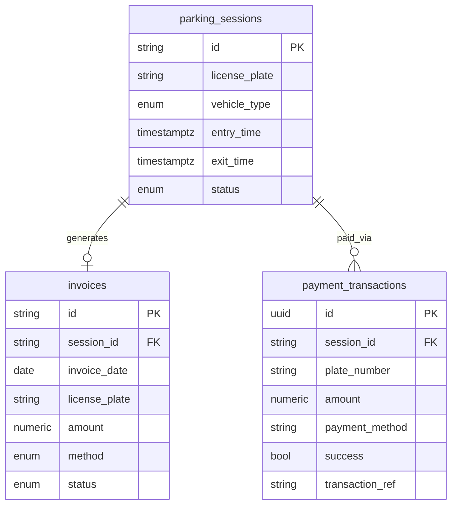

# IOT Parking — FastAPI Backend Spec

This document is derived from the Nuxt frontend (`app/data/*`, composables, and pages). Use it to implement a FastAPI backend that matches what the UI already expects.

**Default base URL (frontend):** `http://localhost:8000`  
**API base URL:** `NUXT_PUBLIC_API_URL` or `app/composables/useApiConfig.ts` (default `http://localhost:8000`). All UI data is loaded from the database via FastAPI.

---

## Conventions

| Topic | Rule |
|--------|------|
| JSON field names | **camelCase** (must match frontend types: `licensePlate`, `entryTime`, …) |
| List response envelope | `{ "data": T[], "total": number, "aggregates"?: object }` |
| Pagination | `page` = 1-based, `limit` = page size (frontend often sends `limit: 50`) |
| Sorting | `sortBy` = column id (see tables below), `sortOrder` = `asc` \| `desc` |
| Search | `search` = free text; frontend filters id, plate, type/amount as noted per resource |
| Multi-select filters | Repeated query params or comma-separated arrays (FastAPI: `status: list[str]`) |
| Dates in JSON | ISO 8601 strings (`2024-05-16T08:30:00` or `2024-05-16` where only date is shown) |
| CORS | Allow frontend origin (e.g. `http://localhost:3000`) |

**Future (UI has date picker, not wired to API yet):** `startDate`, `endDate` (`YYYY-MM-DD`) on list/export endpoints.

---

## Database tables & columns

Recommended PostgreSQL-style schema. API JSON uses camelCase aliases in parentheses.

### 1. `parking_sessions` — vehicle entry/exit (Parking History + Payment)

| DB column | Type | Nullable | API JSON | Notes |
|-----------|------|----------|----------|--------|
| `id` | `VARCHAR(32)` PK | no | `id` | e.g. `PK-1001`; can be UUID/string |
| `license_plate` | `VARCHAR(32)` | no | `licensePlate` | e.g. `2A-1234` |
| `vehicle_type` | `ENUM` | no | `type` | `Car`, `Motorcycle`, `Truck` |
| `vehicle_description` | `VARCHAR(128)` | yes | *(payment only)* | e.g. `SUV - Black` for active session UI |
| `entry_time` | `TIMESTAMPTZ` | no | `entryTime` | formatted for display or ISO string |
| `exit_time` | `TIMESTAMPTZ` | yes | `exitTime` | `null` / `"-"` when still parked |
| `duration_display` | `VARCHAR(32)` | yes | `duration` | e.g. `2h 15m` or `-`; can be computed in API |
| `status` | `ENUM` | no | `status` | `Active`, `Completed` |
| `fee_amount` | `NUMERIC(10,2)` | yes | `amount` | used on Payment page (number, not string) |
| `rate_per_hour` | `NUMERIC(10,2)` | yes | — | UI shows `$2.00 / Hour` |
| `created_at` | `TIMESTAMPTZ` | no | — | audit |
| `updated_at` | `TIMESTAMPTZ` | no | — | audit |

**Indexes:** `license_plate`, `status`, `entry_time`, `(status, entry_time)`.

---

### 2. `invoices` — billing list (Invoices page)

| DB column | Type | Nullable | API JSON | Notes |
|-----------|------|----------|----------|--------|
| `id` | `VARCHAR(32)` PK | no | `id` | e.g. `IN-000001` |
| `session_id` | `VARCHAR(32)` FK → `parking_sessions.id` | yes | — | link to parking session |
| `invoice_date` | `DATE` | no | `date` | `YYYY-MM-DD` |
| `license_plate` | `VARCHAR(32)` | no | `plate` | |
| `amount` | `NUMERIC(10,2)` | no | `amount` | frontend mock uses `"$5.00"` string; prefer **number** in API and format in UI, or return pre-formatted string |
| `method` | `ENUM` | no | `method` | `Cash`, `ABA`, `KHQR` |
| `status` | `ENUM` | no | `status` | `Paid`, `Pending` |
| `transaction_ref` | `VARCHAR(64)` | yes | — | from payment verify |
| `created_at` | `TIMESTAMPTZ` | no | — | audit |

**Indexes:** `invoice_date`, `license_plate`, `status`, `method`.

---

### 3. `payment_transactions` — verify / audit (Payment page)

| DB column | Type | Nullable | Notes |
|-----------|------|----------|--------|
| `id` | `UUID` PK | no | internal |
| `session_id` | `VARCHAR(32)` FK | yes | |
| `plate_number` | `VARCHAR(32)` | no | |
| `amount` | `NUMERIC(10,2)` | no | |
| `payment_method` | `VARCHAR(32)` | no | e.g. `ABA PAY`, `KHQR` |
| `success` | `BOOLEAN` | no | |
| `message` | `TEXT` | yes | |
| `transaction_ref` | `VARCHAR(64)` | yes | e.g. `TRX-123456-POS` |
| `verified_at` | `TIMESTAMPTZ` | no | |

---

### 4. `bank_settings` — QR / transfer info (singleton)

| DB column | Type | API JSON |
|-----------|------|----------|
| `name` | `VARCHAR(64)` | `name` |
| `account_name` | `VARCHAR(128)` | `accountName` |
| `account_number` | `VARCHAR(32)` | `accountNumber` |

One row (or config table with `key`).

---

### 5. Optional analytics tables (Dashboard charts)

Not required for v1 if you compute aggregates in SQL. Frontend shapes:

**`dashboard_stats`** — computed, not necessarily a table:

| Stat label (API) | Suggested source |
|------------------|------------------|
| Active Vehicles | `COUNT(*)` where `parking_sessions.status = 'Active'` |
| Available Spots | `total_spots - active` (add `lot_config.total_spots`) |
| Today Revenue | `SUM(invoices.amount)` where `invoice_date = today` and `status = 'Paid'` |
| Total Entries | `COUNT(parking_sessions)` for today or all-time |

**`occupancy_trend` / `peak_hours`:** time buckets (`08:00`, `10:00`, …) → count of active or entries per hour.

**`vehicle_types` breakdown:** `GROUP BY vehicle_type` → `{ name, value }`.

**Interactive chart** (`INTERACTIVE_CHART_DATASET`): zone × hour matrix — optional `zone_hourly_occupancy` table if you store zone-level metrics.

---

## Frontend table columns (must match `sortBy` / export)

### Parking History (`/parking`)

| Column id (`sortBy`) | Header | Type / enum |
|----------------------|--------|-------------|
| `id` | ID | string |
| `licensePlate` | License Plate | string |
| `type` | Type | `Car` \| `Motorcycle` \| `Truck` |
| `entryTime` | Entry Time | string/datetime |
| `exitTime` | Exit Time | string/datetime or `-` |
| `duration` | Duration | string |
| `status` | Status | `Active` \| `Completed` |

**Filters:** `status[]`, `type[]`  
**Search fields:** `id`, `licensePlate`, `type`

---

### Invoices (`/invoices`)

| Column id (`sortBy`) | Header | Type / enum |
|----------------------|--------|-------------|
| `id` | Invoice ID | string |
| `date` | Date | date string |
| `plate` | License Plate | string |
| `amount` | Amount | string or number |
| `method` | Method | `Cash` \| `ABA` \| `KHQR` |
| `status` | Status | `Paid` \| `Pending` |

**Filters:** `status[]`, `method[]`  
**Search fields:** `id`, `plate`, `amount`

---

### Invoice receipt modal (not a table; POST/create or GET detail)

| Field | Type | Notes |
|-------|------|--------|
| `invoiceNo` | string | |
| `plateNumber` | string | |
| `vehicleType` | string | |
| `entryTime` | string | |
| `exitTime` | string | |
| `duration` | string | |
| `amount` | number | USD, 2 decimals |
| `paymentMethod` | string | |
| `date` | string | |

---

### Payment — active session card

| Field | Type |
|-------|------|
| `plateNumber` | string |
| `vehicleType` | string |
| `entryTime` | string |
| `duration` | string |
| `amount` | number |

---

## REST API endpoints

Replace mock `fetch*` in `app/data/*.ts` with these paths (prefix all with base URL).

### Parking

```
GET /api/parking
```

**Query parameters**

| Param | Type | Description |
|-------|------|-------------|
| `page` | int | default 1 |
| `limit` | int | default 15–50 |
| `sortBy` | string | column ids above |
| `sortOrder` | `asc` \| `desc` | |
| `search` | string | optional |
| `status` | string[] | `Active`, `Completed` |
| `type` | string[] | `Car`, `Motorcycle`, `Truck` |

**Response `200`**

```json
{
  "data": [
    {
      "id": "PK-1001",
      "licensePlate": "2A-1234",
      "type": "Car",
      "entryTime": "2024-05-16 08:30",
      "exitTime": "2024-05-16 10:45",
      "duration": "2h 15m",
      "status": "Completed"
    }
  ],
  "total": 8
}
```

---

### Invoices

```
GET /api/invoices
```

**Query parameters:** same pagination/sort/search as parking, plus:

| Param | Values |
|-------|--------|
| `status` | `Paid`, `Pending` |
| `method` | `Cash`, `ABA`, `KHQR` |

**Response `200`:** same envelope; items match `Invoice` type in `app/data/invoice.ts`.

---

### Payment

```
GET /api/payment/active-session?plate={optional}
```

**Response `200`**

```json
{
  "plateNumber": "2A-1234",
  "vehicleType": "SUV - Black",
  "entryTime": "2024-05-16 08:30 AM",
  "duration": "2 hours 15 minutes",
  "amount": 5.0
}
```

```
POST /api/payment/verify
```

**Body**

```json
{
  "plateNumber": "2A-1234",
  "amount": 5.0,
  "paymentMethod": "ABA PAY"
}
```

**Response `200`**

```json
{
  "success": true,
  "message": "Payment verified successfully.",
  "transactionRef": "TRX-123456-POS"
}
```

On success: close session, create/update `invoices` row, set `status = Paid`.

```
GET /api/payment/bank-info
```

**Response `200`:** `{ "name", "accountName", "accountNumber" }` (optional; today UI uses static `BANK_INFO`).

---

### Dashboard

```
GET /api/dashboard/stats
```

**Response `200`:** array of `{ "label", "value", "icon" }`  
Icons are Lucide names, e.g. `i-lucide-car`, `i-lucide-parking-circle`, `i-lucide-banknote`, `i-lucide-arrow-right-left`.

```
GET /api/dashboard/occupancy-trend
```

**Response `200`:** `[{ "name": "08:00", "value": 20 }, ...]`

```
GET /api/dashboard/vehicle-types
```

**Response `200`:** `[{ "name": "Motorcycle", "value": 180 }, ...]`

```
GET /api/dashboard/peak-hours
```

**Response `200`:**

```json
{
  "labels": ["08:00", "10:00", "12:00"],
  "values": [40, 85, 120]
}
```

---

## FastAPI starter (Pydantic v2)

```python
from enum import Enum
from decimal import Decimal
from pydantic import BaseModel, Field
from typing import Generic, TypeVar

T = TypeVar("T")

class ListResult(BaseModel, Generic[T]):
    data: list[T]
    total: int
    aggregates: dict[str, float] | None = None

class VehicleType(str, Enum):
    car = "Car"
    motorcycle = "Motorcycle"
    truck = "Truck"

class SessionStatus(str, Enum):
    active = "Active"
    completed = "Completed"

class ParkingEntry(BaseModel):
    id: str
    license_plate: str = Field(alias="licensePlate")
    type: VehicleType
    entry_time: str = Field(alias="entryTime")
    exit_time: str = Field(alias="exitTime")
    duration: str
    status: SessionStatus

    model_config = {"populate_by_name": True}

class InvoiceMethod(str, Enum):
    cash = "Cash"
    aba = "ABA"
    khqr = "KHQR"

class InvoiceStatus(str, Enum):
    paid = "Paid"
    pending = "Pending"

class InvoiceOut(BaseModel):
    id: str
    date: str  # YYYY-MM-DD
    plate: str
    amount: str  # or Decimal with serializer
    method: InvoiceMethod
    status: InvoiceStatus
```

**Router sketch**

```python
from fastapi import FastAPI, Query
from fastapi.middleware.cors import CORSMiddleware

app = FastAPI(title="IOT Parking API")
app.add_middleware(
    CORSMiddleware,
    allow_origins=["http://localhost:3000"],
    allow_credentials=True,
    allow_methods=["*"],
    allow_headers=["*"],
)

@app.get("/api/parking", response_model=ListResult[ParkingEntry])
async def list_parking(
    page: int = 1,
    limit: int = 50,
    sort_by: str | None = Query(None, alias="sortBy"),
    sort_order: str | None = Query(None, alias="sortOrder"),
    search: str | None = None,
    status: list[str] | None = Query(None),
    type: list[str] | None = Query(None),
):
    ...
```

---

## Entity relationship (logical)



---

## Wiring the frontend (after backend is ready)

1. Run FastAPI + PostgreSQL and seed data (`backend/scripts/seed.py`).
2. Set `NUXT_PUBLIC_API_URL` if the API is not on `http://localhost:8000`.
3. Frontend `app/data/*.ts` fetch functions call the API via composables in `app/composables/use*Api.ts`.

---

## Suggested implementation order

1. `parking_sessions` CRUD + `GET /api/parking`
2. `GET /api/payment/active-session` + `POST /api/payment/verify`
3. `invoices` + `GET /api/invoices`
4. Dashboard aggregate endpoints
5. Date-range filters + export endpoint (`startDate` / `endDate`)

---

## Source files in this repo

| Area | File |
|------|------|
| Parking types/columns/mock | `app/data/parking.ts` |
| Invoice types/columns/mock | `app/data/invoice.ts` |
| Payment / bank mock | `app/data/payment.ts` |
| Dashboard mock | `app/data/dashboard.ts` |
| Table query params | `app/composables/table/useTableQuery.ts` |
| API base URL toggle | `app/composables/useApiConfig.ts` |
